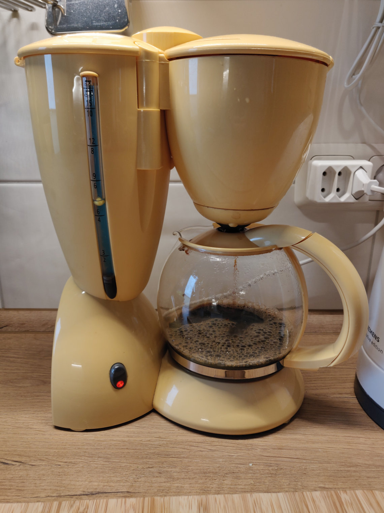
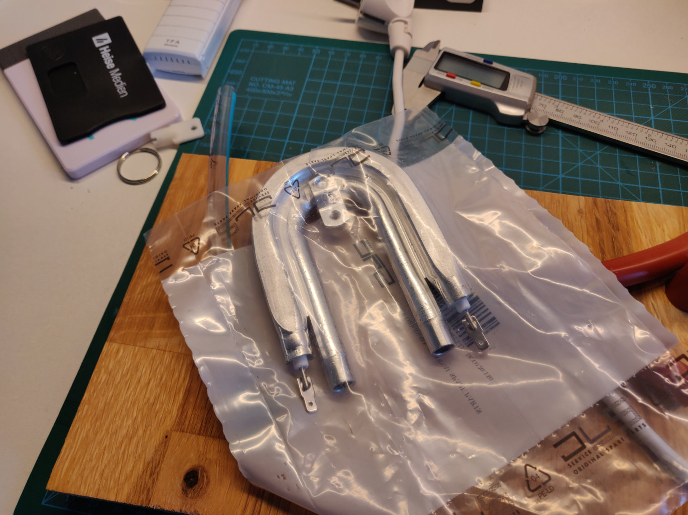
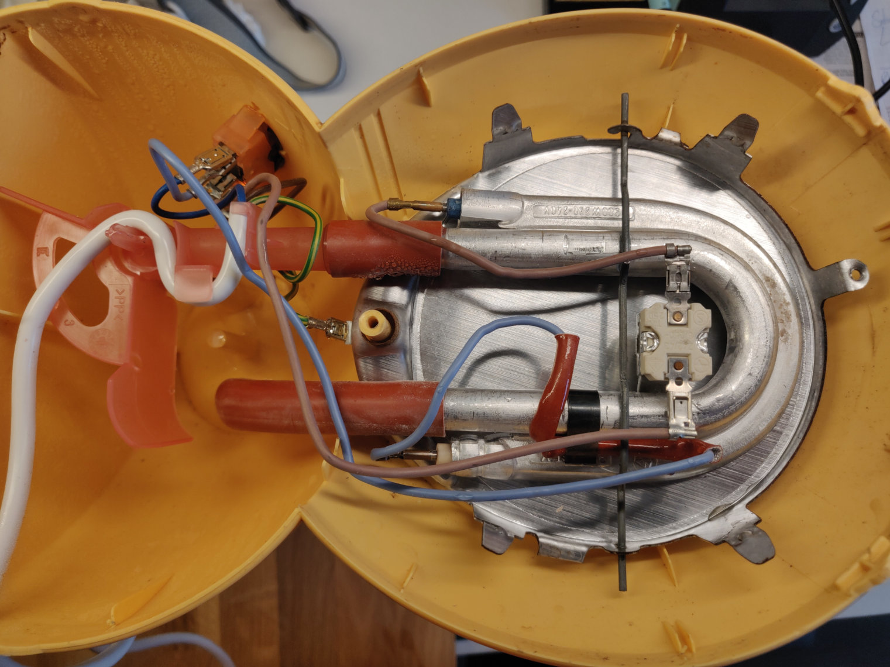
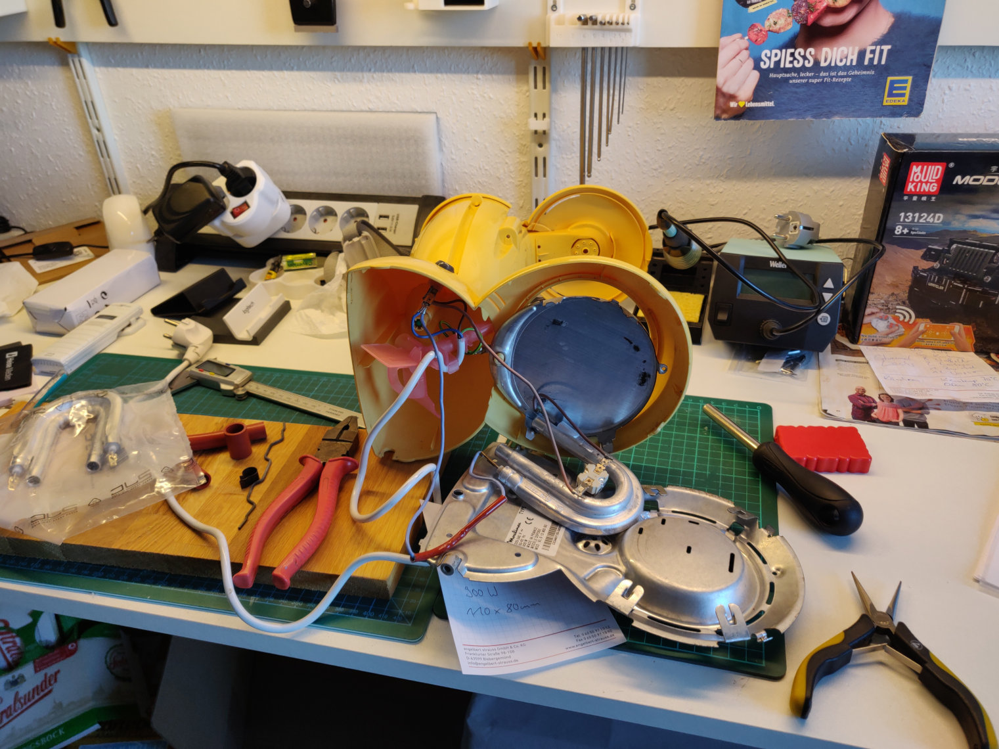

# How to... fix a Moulinex Solea Coffee Maker

## The usual problem

The glass can breaks by accident... 

**Solution:** buy a new one. There are compatible cans available via ebay, since this machine has a lot of fans.

## The real problem

After 25 years the aluminium heating pad breaks and leaks water.

**Fun fact:** after all the investigations and searching for replacement parts, I learned that all coffee makers of the world seem to use only three different heating elements. 

So it's really easy to replace them. Only the dimensions (length/width/power) matter. In this case you need a heating element of 110mm length and 80mm width with 900W power. That's it. 

I ordered one that was labeled as "DeLonghi"... but it was exactly the same heater that Moulinex used for this machine.

Just order it via ebay and watch for the correct dimensions.

## Assembling

...is so trivial... the whole machine is kept together by only three screws and some metal latches. 

**Challenge:** the screws are PZ2, PZ1 and a security Torx screw with an inner hole.
After removing the bottom plate you should see above picture. Now you only have to remove the spring steel lock.

Cut off the flat connectors from the replacement heater and attach existing round connectors again. That's it. 

Mount the bottom plate again and enjoy another 25 years with a beautiful coffee maker that you can't buy today anymore because available now is black and boring.

## You wonder about the yellow water indicator ball?

It's a hollow 3D-printed ball with a diameter of 6mm. 
